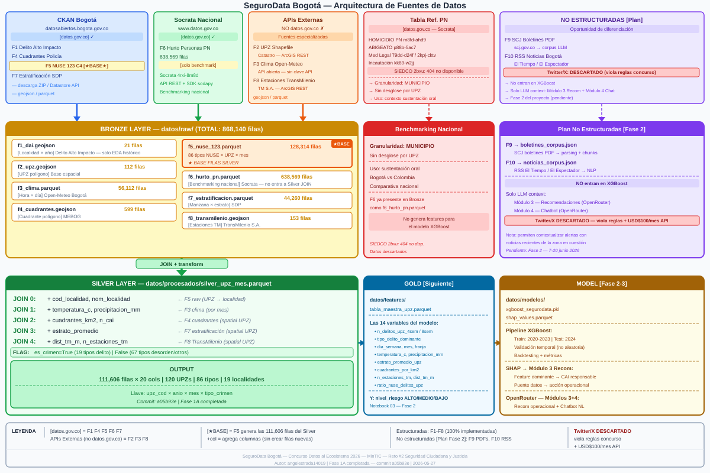
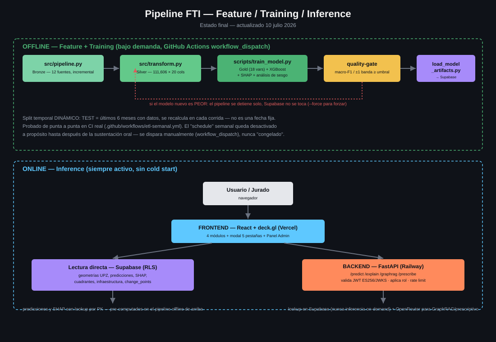

# Arquitectura del Sistema

## Visión general — 5 capas

```
┌─────────────────────────────────────────────────────────────────────┐
│  CAPA 5 — FRONTEND                                                   │
│  React + Vite + deck.gl + Tailwind CSS → Vercel (CDN, siempre ON)   │
│  https://segurodata-frontend.vercel.app                             │
│  4 módulos + modal 5 pestañas + Panel Admin                         │
├─────────────────────────────────────────────────────────────────────┤
│  CAPA 4 — BACKEND ML (Python)                                        │
│  FastAPI (Python) → Railway (siempre activo, sin cold start)         │
│  https://segurodata-api-production.up.railway.app                   │
│  /predict (lookup) · /explain (SHAP) · /graphrag (pgvector+OpenRouter)│
├───────────────────────────┬─────────────────────────────────────────┤
│  CAPA 3 — BASE DE DATOS   │  CAPA 3B — VECTOR STORE                 │
│  Supabase PostgreSQL       │  Supabase pgvector (384 dims)           │
│  + PostGIS (geometrías UPZ)│  Embeddings F10 corpus                  │
│  predictions (1,918 filas) │  sentence-transformers all-MiniLM-L6-v2│
│  shap_values pre-computados│  (indexado una sola vez, offline)       │
│  change_points (ruptures)  │                                         │
├───────────────────────────┴─────────────────────────────────────────┤
│  CAPA 2 — MODEL / GOLD                                               │
│  datos/modelos/  XGBoost + SHAP pre-computado + ruptures            │
│  datos/features/ tabla_maestra_upz.parquet (18 variables)           │
├─────────────────────────────────────────────────────────────────────┤
│  CAPA 1 — BRONZE / SILVER                                            │
│  Bronze: datos/raw/    ← src/pipeline.py   (12 fuentes activas)     │
│  Silver: datos/procesados/ ← src/transform.py  (111,606 × 20 cols)  │
└─────────────────────────────────────────────────────────────────────┘
```

## Medallion Architecture (datos)

```
Bronze  datos/raw/          src/pipeline.py       ← 12 fuentes, descarga incremental
Silver  datos/procesados/   src/transform.py      ← silver_upz_mes.parquet (111,606 × 20)
Gold    datos/features/     scripts/train_model.py ← 18 variables + tabla prescriptiva
Model   datos/modelos/      scripts/train_model.py ← XGBoost + SHAP pre-computado
```

## La tabla Silver (actualizada)

La tabla Silver tiene una fila por cada combinación **UPZ × mes × tipo de incidente** (86 tipos NUSE):

- **Genera filas**: F5 NUSE (128,314 registros raw → 111,606 filas silver)
- **Agrega columnas**: F3 (clima), F4 (cuadrantes), F7 (estrato), F8 (TransMilenio)
- **Nuevas columnas**: F11 (obras IDU), F13 (cámaras Salvavidas), F14 (alumbrado UAESP)
- **No entra al JOIN**: F1 (solo localidad), F6 (solo municipio)
- **Base geométrica**: F2 UPZ (spatial join)

**Resultado: 111,606 filas × 20 columnas, 120 UPZs, 86 tipos NUSE, 19 localidades**

## Stack de aplicación

### Frontend — React + deck.gl
```
React 19 + Vite + Tailwind v4 + shadcn/ui + TanStack Query
deck.gl: GeoJsonLayer (UPZs/localidades/cuadrantes coloreados CRÍTICO/ALTO/MEDIO/BAJO —
         upz_geometrias.geom es MultiPolygon, no PolygonLayer; supabase-js no parsea WKB,
         por eso las RPCs upz_geojson/localidades_geojson/cuadrantes_geojson devuelven
         GeoJSON ya construido)
MapLibre GL JS: basemap CARTO dark, gratuito
supabase-js: acceso directo a PostgreSQL + Realtime desde React
```

### Backend — FastAPI en Railway (Python)

> **Estado:** ✅ **Implementado, verificado y desplegado** — 36 tests verdes, ruff limpio.
> **https://segurodata-api-production.up.railway.app** — `GET /health` responde `{"status":"ok"}`.

Todo el backend es Python. Un solo servicio, un solo lenguaje, un solo deploy. Railway mantiene el servidor siempre activo — sin cold start, sin warmup antes del demo.

#### Estructura del backend (`backend/`)

```
backend/
├── app/
│   ├── main.py            ← create_app() factory + lifespan
│   ├── config.py          ← Settings (pydantic-settings)
│   ├── dependencies.py    ← get_supabase, get_current_user, require_roles
│   ├── routers/           ← health, predict, explain, graphrag, prescribe, auth(/whoami)
│   ├── services/          ← lógica de negocio + filtro por rol (D8)
│   ├── repositories/      ← acceso a tablas/RPC Supabase
│   ├── clients/           ← supabase_client, openrouter_client, embeddings (MiniLM)
│   ├── core/              ← security.py (JWT ES256/JWKS), cache.py (TTLCache 24h)
│   └── data/              ← tabla_ontologica_seed.json (17 filas)
├── tests/                 ← 36 tests unitarios (verdes) + 1 de integración JWT (requiere credenciales reales, excluido por defecto), conftest con fakes y token_factory
├── Dockerfile             ← multi-stage, torch CPU-only, MiniLM horneado
└── railway.toml           ← healthcheckPath="/health", timeout 300
```

#### Endpoints implementados

| Método | Ruta | Roles | Descripción |
|--------|------|-------|-------------|
| GET | `/health` | sin auth | Railway healthcheck |
| GET | `/whoami` | todos | claims del usuario actual (pre-mortem T5) |
| POST | `/predict` | todos auth | lookup predicción pre-computada en Supabase |
| GET | `/explain` | todos auth | SHAP top-3 (completo solo ANALISTA/ADMIN) |
| POST | `/graphrag` | todos auth | embed → pgvector → OpenRouter con citas |
| POST | `/prescribe` | COMANDANTE/ANALISTA/ADMIN | tabla ontológica + LLM |

La `OPENROUTER_API_KEY` se configura como variable de entorno en Railway — nunca se expone al browser. El frontend React llama este endpoint con un POST normal.

### Base de datos — Supabase

> **Estado (30-jun-2026):** ✅ **Proyecto activo** — ref `pluxaelenhkdaakxdrpm` (us-east-1). Migraciones aplicadas. **Artefactos reales del modelo** (`origen='notebook_04'`): 1,918 predicciones + 34,524 SHAP values. Realtime habilitado. Hook JWT activo. change_points: 40 filas. documents_corpus: 10 chunks RSS reales. **Decisión FTI: Silver 111K queda LOCAL** — Supabase solo recibe outputs del modelo, no datos de entrenamiento.

```sql
-- Tablas implementadas (supabase/migrations/)
silver_upz_mes      -- 111,606 filas (carga bulk con scripts/seed_supabase.py)
predicciones        -- niveles de riesgo pre-computados (seed_dev → notebook_04)
shap_values         -- SHAP pre-computados por UPZ × mes × feature
change_points       -- Puntos de cambio ruptures por localidad (2018-2026)
documents_corpus    -- corpus GraphRAG pgvector 384 dims (HNSW m=16)
upz_geometrias      -- 112 polígonos PostGIS (EPSG:4326)
cuadrantes_geom     -- 599 cuadrantes + nom_cai + teléfono (índice GIST)
user_profiles       -- roles + cuadrante_asignado + trigger autoprovision

-- Extensiones habilitadas
CREATE EXTENSION postgis;
CREATE EXTENSION vector;  -- pgvector para embeddings GraphRAG

-- RPC implementada
match_documents(query_embedding, match_threshold, match_count, filter_upz)
  → retrieval semántico con similitud coseno para /graphrag
```

## GraphRAG — sentence-transformers + Supabase pgvector + OpenRouter

El corpus de texto (F10 noticias RSS) se indexa como embeddings en Supabase pgvector:

```
INDEXACIÓN (offline, una sola vez — scripts/index_corpus.py):
F10 RSS → feedparser → texto → all-MiniLM-L6-v2 → pgvector

CONSULTA EN TIEMPO REAL (FastAPI — Python en Railway):
pregunta_usuario
    → FastAPI POST /graphrag
    → sentence-transformers embed la pregunta (Python)
    → Supabase match_documents RPC (pgvector cosine similarity)
    → chunks relevantes recuperados
    → OpenRouter API (google/gemini-2.5-flash-lite) con OPENROUTER_API_KEY server-side
    → respuesta operacional con citas de fuentes reales
```

### Alimentación continua del corpus (idempotencia)

El corpus crece con re-ejecuciones de `index_corpus.py` sin generar duplicados:

1. **Chunking**: el texto se parte en ventanas de ~1,800 caracteres (~500 tokens) con overlap de 200 caracteres, para que ningún concepto quede cortado entre chunks.
2. **Dedup por hash**: cada chunk calcula `content_hash = SHA-256(texto)`. La tabla `documents_corpus` tiene UNIQUE sobre esa columna y el upsert usa `ON CONFLICT (content_hash) DO NOTHING` — re-ejecutar el script solo inserta contenido nuevo.
3. **Cadencia**: F10 RSS puede correrse a diario (las noticias del día se agregan, las ya indexadas se ignoran).

```bash
# Re-ejecutable cuantas veces se quiera — solo entra lo nuevo:
python scripts/index_corpus.py --backend fastembed
```

**Por qué sentence-transformers:** corre local en Python sin costo de API. Genera 384 dimensiones compatibles con pgvector. Un modelo de 22MB que procesa 220 documentos en segundos.

**Por qué OpenRouter:** una sola API key da acceso a 200+ modelos. `google/gemini-2.5-flash-lite` es multilingüe, rápido y de costo marginal (menos de US$0.001 por consulta con `max_tokens=600`) — ideal para el chatbot en español. Se evaluaron los modelos verdaderamente gratis (`:free`) de OpenRouter y resultaron poco confiables para producción: la mayoría está rate-limited por saturación del proveedor, y el único que respondía de forma consistente entregaba respuestas incoherentes pese a razonar correctamente internamente (ver `docs/chatbot_test_battery.md`). Si se requiere mayor calidad o cambia la disponibilidad de modelos, se cambia la variable `LLM_MODEL` sin tocar código.

## Detección de puntos de cambio (ruptures)

El módulo de change point detection corre sobre F1 DAI histórico (2018–2026) por localidad:

```python
import ruptures as rpt
# PELT: Pruned Exact Linear Time — detecta cambios en media de la serie anual
algo = rpt.Pelt(model="l2", min_size=2, jump=1)
algo.fit(signal.reshape(-1, 1))
breakpoints = algo.predict(pen=3)  # pen=3 detecta 1-3 cambios/localidad con 9 puntos anuales
```

**Estado (30-jun-2026):** ✅ **40 breakpoints cargados** en Supabase `change_points` — `scripts/compute_change_points.py`. COVID 2020 validado como BAJA en 17 localidades. "Sin Localización" (bucket sin geocodificación) excluido. Script es idempotente (DELETE + INSERT).

Los resultados alimentan el Módulo 3 (Prescriptivo): si hay un cambio estructural reciente + tendencia sostenida → el diagnóstico es "problema estructural" (no pico temporal) → acción diferente.

## Pipeline ETL y Actualización de Datos

### Flujo Bronze → Silver → Gold

```
src/pipeline.py         →  Bronze  (datos/raw/)          ← extracción incremental 12 fuentes
src/transform.py        →  Silver  (datos/procesados/)   ← spatial joins + limpieza
scripts/train_model.py  →  Gold    (datos/features/)      ← 18 variables + tabla prescriptiva
scripts/train_model.py  →  Model   (datos/modelos/)       ← XGBoost + SHAP pre-computado
```

### Frecuencias de actualización por fuente

| Fuente | Frecuencia real | Estrategia | ¿"Tiempo real"? |
|---|---|---|---|
| F3 — Clima Open-Meteo | Horaria | Append desde `max(time)` en parquet | ✅ Sí — API gratuita sin clave |
| F5 — NUSE 123 | Mensual | Append desde `max_date_in_data` | ❌ Batch mensual |
| F6 — Hurto PN | Mensual | Append desde `max(fecha_hecho)` | ❌ Batch mensual |
| F10 — RSS noticias | Diaria | Append: solo artículos con link nuevo | — |
| F1 / F4 / F7 | Semestral | Full-refresh si `Last-Modified` del servidor cambió | ❌ Semestral |
| F2 / F8 | Estático | Solo descarga inicial (rara vez cambia) | — |

### Cómo activar actualizaciones

**1. Manual local** (desarrollo y pre-demo):
```bash
python src/pipeline.py --source f3 f5 f6   # solo las incrementales rápidas
python src/pipeline.py                      # todas las fuentes
```

**2. GitHub Action** (`.github/workflows/etl-semanal.yml`) — pipeline completo, probado en CI real:

```
pipeline.py (F3/F5/F6, F6 best-effort) → transform.py (Silver) →
train_model.py (split temporal DINÁMICO, últimos 6 meses = test) →
load_model_artifacts.py (BLOQUEADO por quality-gate de metricas.json) →
commit de metricas.json de vuelta al repo (historial versionado)
```

El quality-gate (`scripts/load_model_artifacts.py::validar_metricas()`) compara macro-F1 y
accuracy±1banda contra umbrales mínimos **antes** de tocar Supabase — si el modelo nuevo es peor,
el job falla solo y la base de datos en producción no se toca. El split temporal ya no es una fecha
fija: se recalcula en cada corrida a partir del último período real disponible.

El `schedule` semanal sigue **desactivado a propósito**:
```yaml
schedule:
  - cron: '0 6 * * 1'   # cada lunes 6 AM UTC = 1 AM Bogotá
```
Recomendación del equipo: no activarlo antes de la sustentación oral — un reentrenamiento
automático cayendo en medio de la ventana de demo es justo el riesgo que motivó el quality-gate.
Se puede disparar manualmente en cualquier momento desde GitHub Actions → "Run workflow".

**Requisitos para correr el workflow** (GitHub → Settings → Secrets and variables → Actions):
`SUPABASE_URL`, `SUPABASE_SERVICE_KEY` (mismos valores que `backend/.env`), `SOCRATA_APP_TOKEN`
(opcional — solo afecta F6, que no alimenta el modelo). Además, Settings → Actions → General →
Workflow permissions debe estar en **"Read and write permissions"** para que el paso final pueda
commitear `metricas.json` de vuelta al repo.

**3. Pre-demo** (día de la presentación):
Railway está siempre activo — no requiere calentamiento. Verificar 5 minutos antes que `/health` responde y que Supabase tiene datos recientes de F3 (clima).

### El "tiempo real" del frontend

El frontend **no hace polling**. Usa **Supabase Realtime** (WebSocket): cuando `pipeline.py` inserta filas nuevas en Supabase, el mapa de deck.gl se actualiza sin recargar la página.

- **F3 clima**: puede actualizarse con datos del mismo día
- **F5 NUSE**: mensual — llega el primer día hábil de cada mes
- Los datos de crimen histórico son batch mensual — no existe ninguna API pública de Bogotá con crimen en tiempo real

---

## Autenticación y control de acceso

**Supabase Auth** gestiona identidad sin agregar dependencias nuevas al stack. Free tier cubre hasta 50,000 MAU — suficiente para el concurso y un piloto real.

```
Métodos de autenticación:
  Magic link (email) → para onboarding de oficiales por invitación
  OAuth Google         → para ciudadanos y analistas

Autoaprovisionamiento por dominio institucional (Auth Hook de Supabase):
  @policia.gov.co   → COMANDANTE_CAI  (pendiente asignación de cuadrante por ADMIN)
  @sdscj.gov.co     → ANALISTA_SDSCJ
  cualquier otro    → CIUDADANO (requiere aprobación de ADMIN)
```

**Supabase RLS (Row Level Security)** controla el acceso a datos a nivel de fila en PostgreSQL — el rol se guarda en la tabla `user_profiles` y se valida en cada query sin pasar por FastAPI:

```sql
-- Comandante solo ve predicciones de las UPZs de su cuadrante
CREATE POLICY "comandante_solo_su_cuadrante"
  ON predicciones FOR SELECT
  USING (upz_cod = ANY(
    SELECT upz_cod FROM cuadrantes_geom
    WHERE cuadrante_id = auth.jwt()->>'cuadrante_asignado'
  ));
```

**FastAPI valida el JWT de Supabase** en requests a endpoints sensibles (`/predict`, `/prescribe`):

```python
# FastAPI extrae y verifica el token de Supabase en cada request
# Verifica la firma ES256 contra el JWKS público de Supabase (SUPABASE_JWKS_URL)
# Extrae claims: rol, cuadrante_asignado → decide si responde o retorna 403
```

**Nota de seguridad:** el dominio `@policia.gov.co` confirma acceso al buzón institucional, no identidad del oficial. Para producción real se requeriría integración con el directorio LDAP de la MEBOG. Para el prototipo del concurso, el flujo de invitación manual por ADMIN es el mecanismo de verificación.

---

## Diagrama de arquitectura



## Pipeline FTI — entrenamiento vs. inferencia


